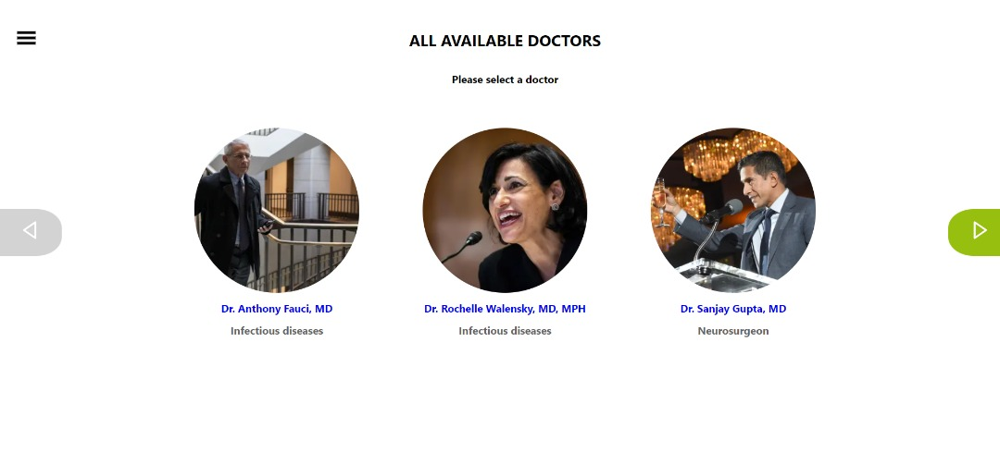
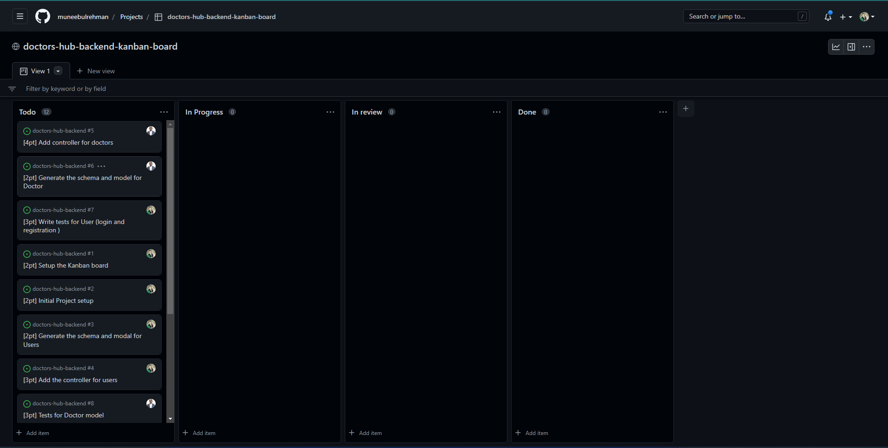

# Doctors Hub backend (API)

Backend repository for the final capstone project of the **Doctors Hub**. Developed using Ruby on Rails, this is an API which responds in JSON.
Visit the [Frontend repo]()

### Preview

### Live version

[Check live version here](https://doctors-hub-frontend.netlify.app/)

### Link to API 

[Check out the API](https://doctors-hub-backend-api.herokuapp.com)

### Kanban board

[Link](https://github.com/users/muneebulrehman/projects/1)

### Team information

We are a team of three.

1. [@Muneeb ul Rehman](https://github.com/muneebulrehman)
2. [@Ezekiel Utshudi Eteta](https://github.com/EzekielUtshudi)
3.[@Sangwa Didie](https://github.com/sangwa7)

### Built with

- Ruby on Rails

## Getting started

#### Prerequisites

- Ruby
- Ruby on Rails
- PostgreSQL

#### Setup

Clone [this](https://github.com/muneebulrehman/doctors-hub-backend) repo

- Navigate to the directory and run `bundle install` to install the dependencies.
- Run `rails db:create` to create the database.
- Run `rails db:migrate` to migrate the database.
- Run `rails s` to start the server.

### Authors

👤 **Muneeb Ul Rehman**

- GitHub: [@Muneeb](https://github.com/muneebulrehman)
- Twitter: [@NeatCoder\_](https://twitter.com/NeatCoder_)
- LinkedIn: [Muneeb](https://www.linkedin.com/in/muneebulrehman/)

👤 **Ezekiel Utshudi**

- GitHub: [@EzekielUtshudi](https://github.com/EzekielUtshudi)
- Twitter: [@UtshudiEzekiel](https://twitter.com/UtshudiEzekiel)
- LinkedIn: [@ezekiel-utshudi](https://www.linkedin.com/in/ezekiel-utshudi-195782162/)

👤 **Sangwa Didier**

- GitHub: [Didier Sangwa](https://github.com/sangwa7)
- Twitter: [@sangwa_7](https://twitter.com/sangwa_7)
- LinkedIn: [Didier Sangwa](https://www.linkedin.com/in/didier-sangwa)

### 🤝 Contributions

Contributions, issues, and feature requrests are welcome!

Feel free to check the [issues page](https://github.com/muneebulrehman/doctors-hub-backend/issues).

### 📝 License

This project is MIT licensed.
